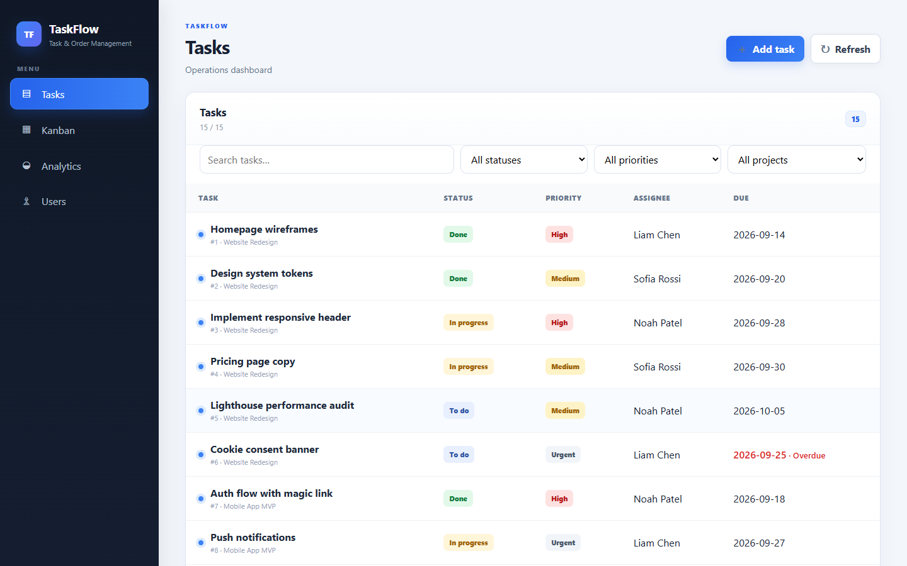
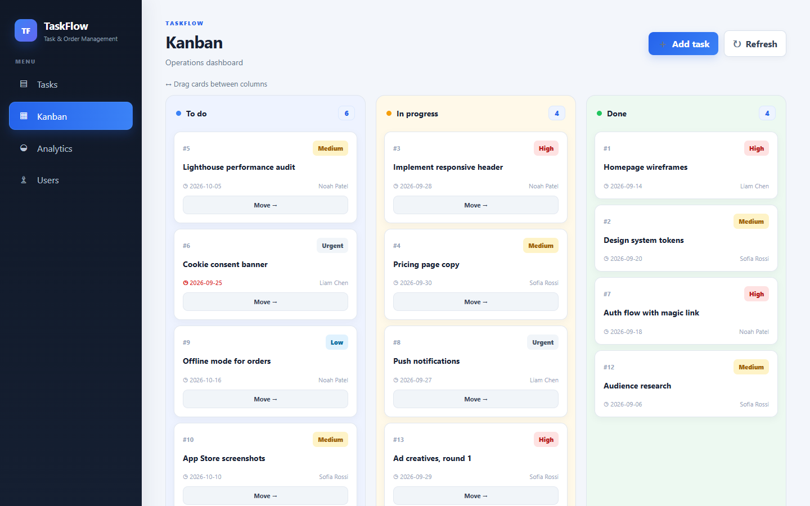
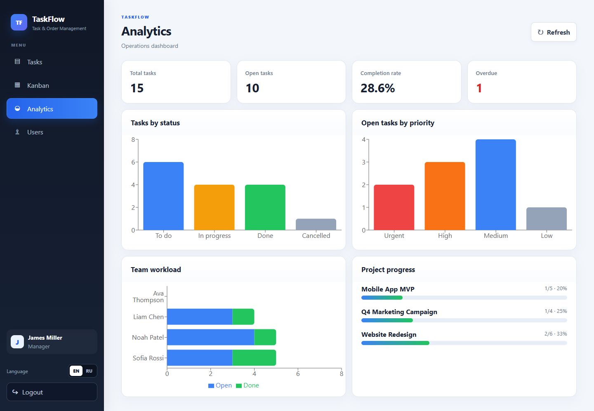
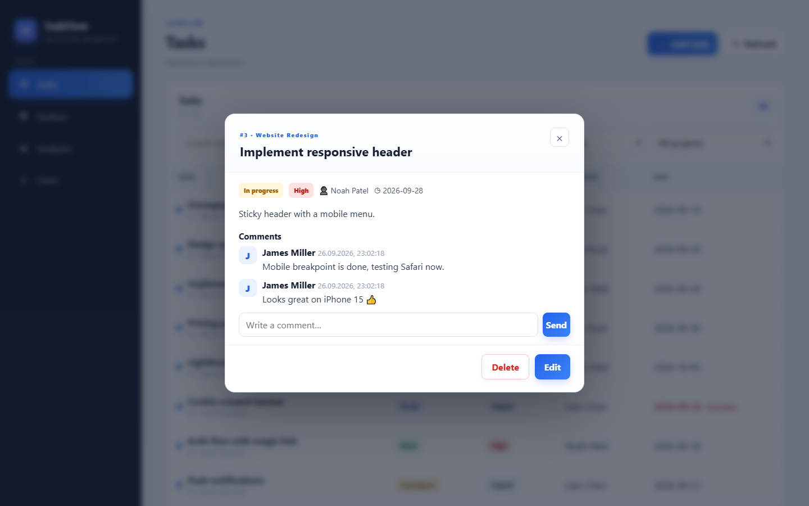
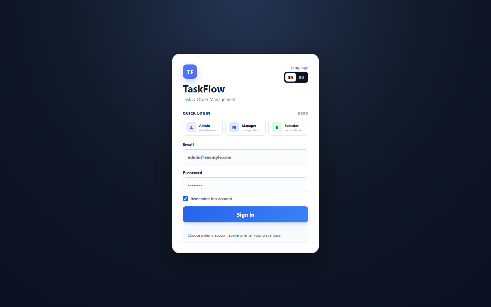

# TaskFlow — Task & Order Management

A full-stack web app for small teams to plan work, track tasks on a Kanban board and see delivery metrics at a glance. Built with **FastAPI + React/TypeScript + PostgreSQL**, shipped with Docker Compose and CI.



## The problem → the solution

**Problem.** Small teams and agencies often track orders in chats and spreadsheets: nobody knows who is working on what, deadlines slip, and managers spend hours collecting status updates.

**Solution.** One workspace with three roles:
- **Managers** create projects and tasks, assign executors and track progress on the board and dashboard.
- **Executors** see only their own tasks and move them through the workflow.
- **Admins** manage the team and permissions.

**What it gives.** Status is visible in real time, overdue tasks are highlighted automatically, and a weekly report comes straight from the analytics page.

## Features

- 🔐 **JWT authentication** with access + refresh tokens (silent token renewal in the UI)
- 👥 **Role-based access control** (admin / manager / executor), enforced on the API, not just hidden in the UI
- ✅ **Tasks** with priorities, due dates, assignees, projects, search and filters
- 🗂 **Kanban board** with drag-and-drop between columns
- 💬 **Comments** on tasks
- 📊 **Analytics**: KPIs, completion rate, overdue tasks, team workload, project progress
- 🌍 **English / Russian** interface, localized API error messages
- 🧪 **Automated tests** for auth, permissions, CRUD, cascades and analytics
- 🐳 **One-command start** with Docker Compose; production build served by nginx
- ⚙️ **CI** on GitHub Actions: backend tests and a TypeScript production build

## Screenshots

| Kanban with drag-and-drop | Analytics |
|---|---|
|  |  |

| Task details and comments | Login with demo accounts |
|---|---|
|  |  |

## Tech stack

| Layer | Technologies |
|---|---|
| Backend | Python 3.12, FastAPI, SQLAlchemy 2, Pydantic 2, PyJWT, Argon2 password hashing |
| Frontend | React 18, TypeScript (strict), Vite, Recharts, Axios |
| Database | PostgreSQL 16 (SQLite for tests) |
| DevOps | Docker, Docker Compose, nginx, GitHub Actions |

## Architecture

```text
┌──────────────┐   REST/JSON + JWT   ┌──────────────┐    SQL     ┌──────────────┐
│ React SPA    │ ──────────────────▶ │ FastAPI      │ ─────────▶ │ PostgreSQL   │
│ (nginx)      │ ◀────────────────── │ RBAC, tests  │ ◀───────── │              │
└──────────────┘                     └──────────────┘            └──────────────┘

backend/
  app/api/        routers: auth, users, projects, tasks, analytics
  app/core/       settings, password hashing, JWT
  app/models/     SQLAlchemy models
  app/schemas/    Pydantic request/response schemas
  app/demo.py     realistic demo workspace
  tests/          API tests (pytest)
frontend/src/
  pages/          Tasks, Kanban, Analytics, Users, Login
  components/     task form, task details with comments, language switch
  api/client.ts   Axios client with automatic token refresh
  i18n.tsx        EN/RU translations
```

## Quick start

```bash
git clone https://github.com/R4yClay/task-order-system.git
cd task-order-system
docker compose up -d --build
```

Open **http://localhost:5173**. The API docs (Swagger) are at **http://localhost:8000/docs**.

Demo accounts (also available as one-click buttons on the login page):

| Role | Email | Password |
|---|---|---|
| Admin | admin@example.com | Admin12345! |
| Manager | manager@example.com | Manager123! |
| Executor | executor@example.com | Executor123! |

A demo workspace with 3 projects and 15 tasks is created on the first start. Disable it with `SEED_DEMO_DATA=false`.

## Configuration

Copy `.env.example` to `.env` to change ports, secrets or the API URL. For production set `APP_ENV=production` and a strong `JWT_SECRET`: the API refuses to start with the default secret.

## Running tests

```bash
cd backend
python -m venv .venv && . .venv/bin/activate   # Windows: .venv\Scripts\activate
pip install -r requirements.txt
pytest
```

## API overview

| Method | Endpoint | Access |
|---|---|---|
| POST | `/api/auth/login`, `/api/auth/refresh` | public |
| GET | `/api/auth/me` | any user |
| GET/POST/PATCH/DELETE | `/api/projects` | read: all · write: admin, manager |
| GET/POST/PATCH/DELETE | `/api/tasks` | executors see and move only their own tasks |
| PATCH | `/api/tasks/{id}/status` | assignee, manager, admin |
| GET/POST | `/api/tasks/{id}/comments` | anyone who can see the task |
| GET | `/api/analytics/summary` | admin, manager |
| GET/POST/PATCH | `/api/users` | admin manages users and roles |

---

Need a similar system for your team, a custom dashboard or an internal tool? Feel free to reach out.
